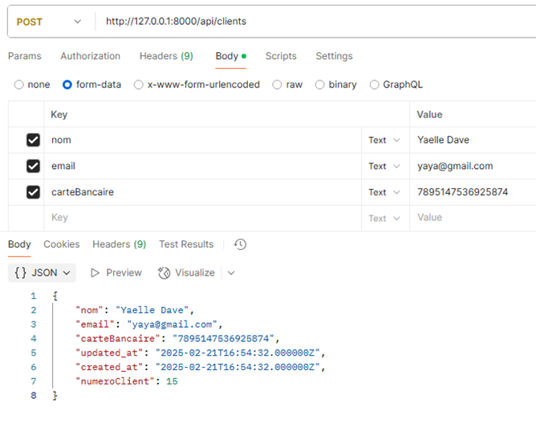
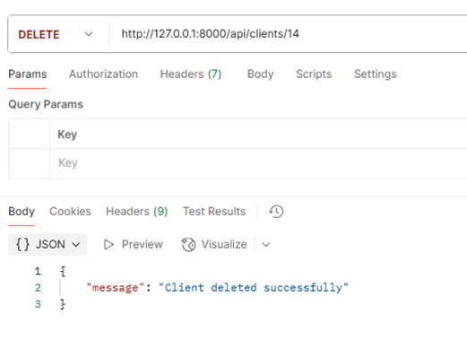
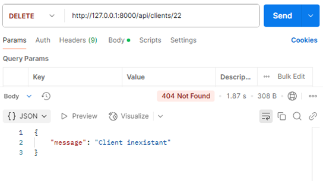

# Rapport d'API - Gestion des Clients

## 1. Création du Contrôleur Client pour l'API

Afin de transformer la gestion des clients du projet en une API, la première étape a été de créer un nouveau contrôleur spécifique pour l'API. Cela permet de ne pas perdre l'ancienne version du contrôleur.

```php
php artisan make:controller Api/ClientController
```

Cette commande génère un nouveau contrôleur ClientController dans un sous-dossier Api, isolant ainsi les fonctionnalités liées à l'API des autres parties du projet.


## 2. Adaptation des Méthodes du Contrôleur

Ensuite, il a été nécessaire d'adapter chaque méthode du contrôleur existant afin de retourner des réponses au format JSON, au lieu d’utiliser des vues.

Par exemple, la méthode show dans le contrôleur initial était définie comme suit :

```php
    public function show($numeroClient)
    {
        $client = Client::where('numeroClient', $numeroClient)->firstOrFail();
        return view('clients.show', compact('client'));
    }
```

Dans la nouvelle version API, elle a été modifiée pour retourner une réponse JSON, ainsi :

```php
    public function show($numeroClient)
    {
        $client = Client::find($numeroClient);
        if(!$client){
            return response()->json(["message"=> "Client inexistant"],404);
        }
        return response()->json($client);
    }
```
Ici, en cas de client inexistant, une réponse JSON avec un message d’erreur et un code HTTP 404 est renvoyée.
Si le client est trouvé, ses informations sont retournées au format JSON.


## 3. Définition des Routes API

Pour exposer les fonctionnalités de notre contrôleur API, il a fallu définir les routes correspondantes. Ces routes sont ajoutées dans le fichier routes/api.php afin de gérer les requêtes API sans interférer avec les routes web classiques.

```php
use App\Http\Controllers\Api\ClientController;

Route::apiResource('clients', ClientController::class);
```
Cette ligne de code permet de créer automatiquement les routes RESTful dont nous avons besoin pour les méthodes index, store, show, update et destroy du contrôleur, facilitant ainsi la gestion des clients via des requêtes HTTP.

## 4. Test de l'API
Une fois les routes mises en place, il est possible de tester directement les requêtes GET dans l'URL de l'application en utilisant un navigateur ou un outil comme Postman. Par exemple, en accédant à l'URL suivante :
http://127.0.0.1:8000/api/clients/1

La réponse JSON pour un client d'index de base de données 1 trouvé correspond à ceci :

```json
{
  "NumeroClient": 1,
  "nom": "Eleanora Heathcote",
  "email": "theron84@example.net",
  "carteBancaire": "2375714316779650",
  "created_at": "2025-02-13T09:02:28.000000Z",
  "updated_at": "2025-02-13T09:02:28.000000Z"
}
```

Les tests ont également été effectués dans [Postman](https://www.postman.com/), un outil de test d'API, pour valider que le contrôleur renvoie bien les données attendues au format JSON. Cet outil a notammant permis la vérification des requêtes de type POST ou DELETE.
Un affichage de la liste complète des clients après coup permet de vérifier le fonctionnement de ces méthodes.

### Création d'un client


### Suppression d'un client


En cas de tentative de suppression ou d'affichage d'un client inexistant, l'API renvoie un code de statut HTTP 404 accompagné d'un message d'erreur.




## Conclusion

L'API pour la gestion des clients a été mise en place avec succès, permettant d'effectuer des opérations CRUD via des requêtes HTTP. Les tests effectués ont montré que les données des clients sont correctement renvoyées en format JSON, et les erreurs sont gérées avec des codes de statut HTTP appropriés.
